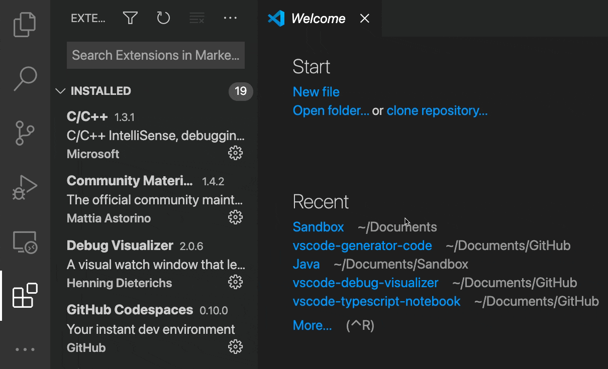

---
# DO NOT TOUCH — Managed by doc writer
ContentId: f4d4e9e0-8901-405c-aaf5-faa16c32588b
DateApproved: 7/6/2023

# Summarize the whole topic in less than 300 characters for SEO purpose
MetaDescription: Use Visual Studio Code's Proposed API
---

# 使用建议的 API

在Visual Studio Code中，我们非常重视扩展API的兼容性。我们尽最大努力避免破坏API更改，扩展作者可以期望发布的扩展继续工作。然而，这给我们带来了很大的限制:一旦我们引入了一个API，我们就不能再轻易地改变它了。

提议的API为我们解决了这个问题。
建议的API是一组不稳定的AP，它们在VS Code中实现，但不像稳定的API那样向公众公开。
它们 **可能会发生变化，仅在Insiders发行版中可用，不能在已发布的扩展中使用**。
然而，扩展作者可以在本地开发中测试这些新的AP，并为VS Code团队提供反馈，以迭代API。
最终，建议的API会进入稳定的API，并可用于所有扩展。

## 使用建议的API

These are the steps for testing a proposed API in local extension development:

- Use [Insiders](/insiders) release of VS Code.
- To your `package.json`, add `"enabledApiProposals": ["<proposalName>"]`.
- Copy the corresponding [vscode.proposed.\<proposalName\>.d.ts](https://github.com/microsoft/vscode/blob/main/src/vscode-dts) files into your project's source location.

The [@vscode/dts](https://github.com/microsoft/vscode-dts) CLI utility allows you to quickly download the latest `vscode.proposed.<proposalName>.d.ts` for extension development. It downloads definition files by the proposals listed in your `package.json` file.

```bash
> npx @vscode/dts dev
Downloading vscode.proposed.languageStatus.d.ts
To:   /Users/Me/Code/MyExtension/vscode.proposed.languageStatus.d.ts
From: https://raw.githubusercontent.com/microsoft/vscode/main/src/vscode-dts/vscode.proposed.languageStatus.d.ts
Read more about proposed API at: https://code.visualstudio.com/api/advanced-topics/using-proposed-api
```

There is a sample using proposed APIs: [proposed-api-sample](https://github.com/microsoft/vscode-extension-samples/tree/main/proposed-api-sample).

## Proposed API incompatibility

On the main branch, the `vscode.proposed.<proposalName>.d.ts` is always compatible with `vscode.d.ts`. However, when you add `vscode.proposed.<proposal>.d.ts` to your project that uses `@types/vscode`, the latest `vscode.proposed.<proposal>.d.ts` might be incompatible with the version in `@types/vscode`.

You can solve this issue by either:

- Remove dependency on `@types/vscode` and use `npx @vscode/dts main` to download `vscode.d.ts` from `microsoft/vscode` main branch.
- Use `@types/vscode@<version>` and also use `npx @vscode/dts dev <version>` to download the `vscode.proposed.<proposal>.d.ts` from an old branch of `microsoft/vscode`. However, be careful as the API might have changed in the latest version of VS Code Insiders.

## Sharing extensions using the proposed API

While you're not able to publish extensions using the proposed API on the Marketplace, you can still share your extension with your peers by packaging and sharing your extension.

To package your extension, you can run `vsce package` to create a VSIX file of your extension. You can then share this VSIX file to others to install the extension in their VS Code.

To install an extension from a VSIX file, you would go into the Extensions view, select the **...** ellipsis **View and More Actions** button, and select **Install from VSIX**.

Selecting the **Install from VSIX** menu item is shown in the short video below.



For extensions using the proposed API, there are a couple more steps to enable your extension. After installing from your VSIX, you need to quit and relaunch VS Code Insiders from command line with `code-insiders . --enable-proposed-api=<YOUR-EXTENSION-ID>` in your project folder.

If you'd like to set it so that your extension using the proposed API is always available to use on every launch of VS Code Insiders, you can run the **Preferences: Configure Runtime Arguments** command to edit the `.vscode-insiders/argv.json` file to set a list of enabled extensions.

```json
{
    ...
    "enable-proposed-api": ["<YOUR-EXTENSION-ID>"]
}
```
