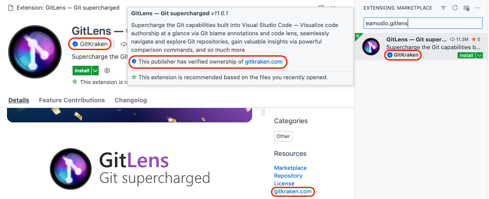

---
# DO NOT TOUCH — Managed by doc writer
id: 7EA90618-43A3-4873-A9B5-61CC131CE4EE
DateApproved: 7/6/2023

# Summarize the whole topic in less than 300 characters for SEO purpose
description: Learn how to publish Visual Studio Code extensions to the public Marketplace and share them with other developers.
sidebar_position: 2
---

# 发布扩展

一旦你做了高质量的扩展, 你可以把它发布到 [VS Code扩展市场](https://marketplace.visualstudio.com/vscode) 这样别人就能找到, 下载, 使用你的分机. 另外, 您可以将扩展包[打包](#packaging-extensions)成可安装的VSIX格式，并与其他用户共享。

本主题涵盖:

- 使用 [vsce](#vsce), 管理VS Code扩展的CLI工具
- [包装](#packaging-extensions), [发布](#publishing-extensions) 和 [取消发布](#unpublishing-extensions) 扩展
- [注册发布者](#create-a-publisher) 发布扩展所必需的

## vsce

[vsce](https://github.com/microsoft/vscode-vsce), "Visual Studio Code Extensions"的缩写, 是一个用于打包、发布和管理VS Code扩展的命令行工具。

### 安装

确保你有 [Node.js](https://nodejs.org/) 安装. 然后运行:

```bash
npm install -g @vscode/vsce
```

### 使用

你可以用 `vsce` 很容易[打包](#packaging-extensions) 和 [发布](#publishing-extensions) 你的扩展:

```bash
$ cd myExtension
$ vsce package
# myExtension.vsix generated
$ vsce publish
# <publisher id>.myExtension published to VS Code Marketplace
```

`vsce` 也可以搜索, 检索元数据, 取消发布扩展. 供所有可用 `vsce` 命令的参考, 运行 `vsce --help`.

## 发布扩展

---

**请注意:** 出于安全考虑, `vsce` 不会发布包含用户提供的SVG图像的扩展。

发布工具检查以下约束:

- `package.json`中提供的图标可能不是SVG。
- `package.json`中提供的徽章可能不是svg，除非它们来自[受信任的徽章提供商](/api/references/extension-manifest#approved-badges).
- `README.md` 和 `CHANGELOG.md` 中的Image URLs 需要解析为`https`url。
- `README.md` 和 `CHANGELOG.md` 中的Images 可能不是SVG，除非它们来自[可信的徽章提供商](/api/references/extension-manifest#approved-badges).

---

Visual Studio Code使用[Azure DevOps](https://azure.microsoft.com/services/devops/)作为其市场服务。这意味着扩展的身份验证、托管和管理是通过Azure DevOps提供的。

`vsce` 只能使用[个人访问令牌](https://learn.microsoft.com/azure/devops/organizations/accounts/use-personal-access-tokens-to-authenticate)发布扩展.
要发布扩展，您至少需要创建一个扩展。

### 获得个人访问令牌

首先，按照文档在Azure DevOps中[创建您自己的组织](https://learn.microsoft.com/azure/devops/organizations/accounts/create-organization)。
在下面的例子中，组织的名称是' `vscode` '，您应该使用您的新组织名称作为适当的。
请注意，组织的名称不一定要与您的发布者名称相同。

1. 从您的组织的主页 (例如: `https://dev.azure.com/vscode`), 打开您的个人资料图像旁边的用户设置下拉菜单，然后选择 **Personal access tokens**:

   

1. 在 **Personal Access Tokens** 页面, 选择 **New Token**:

   

1. 在“创建新的个人访问令牌”模式中，为令牌选择以下详细信息:

   - Name: 任何您想要的令牌名称
   - Organization: **All accessible organizations**
   - Expiration (optional): 为令牌设置所需的到期日期
   - Scopes: **Custom defined**:
     - 点击 **Scopes** 部分下面的 **Show all scopes** 链接
     - 在范围列表中，滚动到**Marketplace**并选择**Manage** 范围

   

1. 点击 **Create**.

   您将看到新创建的个人访问令牌。 把它 **Copy** 到安全的地方, 你需要它 [create a publisher](#create-a-publisher).

### 创建发行商

A **publisher** 是一个可以向Visual Studio Code Marketplace发布扩展的标识。
每个扩展都需要在它的 [`package.json` 文件](/api/references/extension-manifest) 中包含一个`publisher`的名字。

创建一个发布者:

1. 转到[Visual Studio Marketplace发行商管理页面](https://marketplace.visualstudio.com/manage).
1. 使用您在上一节中用于创建[个人访问令牌](#get-a-personal-access-token)的相同Microsoft帐户登录。
1. 单击左侧窗格中的**创建发布者**。
1. 在新页面中，为新发布者指定必需参数-标识符和名称(分别为**ID**和** name **字段):

   - **ID**: 您的出版商在市场中的 **唯一** 标识符，将在您的扩展url中使用。ID一旦创建就不能修改。
   - **Name**: 您的出版商的 **唯一** 名称，将与您的扩展一起显示在Marketplace中。这可以是你的公司或品牌名称。

   下面是Docker扩展的发布者标识符和名称的示例:

   

1. 可选地，填写其余字段。
1. 点击 **Create**
1. 使用`vsce`验证新创建的发布者。在您的终端上，运行以下命令，并在提示时键入在上一步中创建的个人访问令牌:

   ```bash
   vsce login <publisher id>

   https://marketplace.visualstudio.com/manage/publishers/
   Personal Access Token for publisher '<publisher id>': ****************************************************

   The Personal Access Token verification succeeded for the publisher '<publisher id>'.
   ```

经过验证后，就可以发布扩展了。

### 发布扩展

您可以通过两种方式发布扩展:

1. 自动,使用 `vsce publish` 命令:

   ```bash
   vsce publish
   ```

   如果您还没有使用上面的`vsce login`命令提供您的个人访问令牌，`vsce`将要求您提供它。

1. 手动使用`vsce package`将扩展包打包成可安装的VSIX格式，然后将其上传到[Visual Studio Marketplace发行商管理页面](https://marketplace.visualstudio.com/manage):

   

## 审查扩展安装和评级

[Visual Studio Marketplace发行商管理页面](https://marketplace.visualstudio.com/manage)让您可以访问每个扩展的收购趋势随着时间的推移，以及总收购计数和评级和评论。
要查看报告，请单击扩展名或选择 **More Actions > Reports**.


## 自动增加扩展版本

发布扩展时，可以通过指定的方法自动增加其版本号 [SemVer](https://semver.org/)-兼容号码或版本 (`major`, `minor`, 或 `patch`)对增量. 例如，要将扩展的版本从1.0.0更新到1.1.0，您可以指定:

```bash
vsce publish minor
```

or

```bash
vsce publish 1.1.0
```

这两个命令都将首先修改扩展的' `package.json` ' [version](/api/references/extension-manifest#fields)属性，然后发布更新后的版本。

> **Note:** 如果你在git的repo中运行`vsce publish`，它也会创建一个版本提交并通过[npm-version]标记(https://docs.npmjs.com/cli/version#description). 默认提交消息将是扩展的版本，但您可以使用`-m`标志提供自定义提交消息。 (当前版本可以从带有`%s`的提交消息中引用。).

## 取消发布扩展

你可以从[Visual Studio Marketplace发布者管理页面]取消发布扩展(https://marketplace.visualstudio.com/manage) 通过点击**More Actions > Unpublish**:


一旦未发布，扩展的可用性状态更改为 **Unpublished** ，它将不再可用于从市场和Visual Studio代码下载:


> **Note:** 当您取消发布扩展时，Marketplace将保留扩展统计信息。

## 删除扩展

您可以通过两种方式删除扩展:

1. Automatically, using [`vsce`](#vsce) with the `unpublish` command:

   ```bash
   vsce unpublish <publisher id>.<extension name>
   ```

1. Manually, from the [Visual Studio Marketplace publisher management page](https://marketplace.visualstudio.com/manage) by clicking **More Actions > Remove**:

   

In both cases, you will be prompted to confirm the removal by typing the extension name. Note that the removal action is **irreversible**.

> **Note:** When you unpublish an extension, the Marketplace will remove any extension statistics. You may want to update your extension rather than unpublish it.

## 作废扩展

可以弃用一个扩展，也可以弃用另一个扩展或设置。VS Code不会自动迁移或卸载已弃用的扩展。VS Code将在UI中显示不推荐的扩展，如下面的搜索示例所示，其中第一个结果是不推荐的。如果一个被弃用的扩展有一个可选的扩展或设置，VS Code UI将引导用户迁移到新的扩展或设置。


VS Code will not automatically migrate or uninstall already installed deprecated extensions. Instead it will provide the following Migrate UI:


In order to mark your extension as deprecated, please reach out to us by commenting [here](https://github.com/microsoft/vscode-discussions/discussions/1).

> **Note:** 目前，该扩展不会在Marketplace中显示为已弃用。稍后将对此提供支持。

## 包装扩展

If you want to test an extension on your local install of VS Code or distribute an extension without publishing it to VS Code Marketplace, you can choose to package your extension. `vsce` can package your extension into a `VSIX` file, from which users can easily install. Some extensions publish VSIX files to each GitHub release.

For extension authors, they can run `vsce package` in extension root folder to create such VSIX files.

For users who receive such a VSIX file, they can install the extension with `code --install-extension my-extension-0.0.1.vsix`.

### 与他人私下分享

如果你想私下和别人分享你的扩展，你可以把你打包的扩展`.vsix`文件发给他们。

## 您的扩展文件夹

要加载扩展，你需要将文件复制到VS Code扩展文件夹`.vscode/extensions`中。根据您的平台，它位于以下文件夹中:

- **Windows** `%USERPROFILE%\.vscode\extensions`
- **macOS** `~/.vscode/extensions`
- **Linux** `~/.vscode/extensions`

## Visual Studio Code 兼容性

在编写扩展时，您需要描述扩展与Visual Studio Code本身的兼容性。 This can be done via the `engines.vscode` field inside `package.json`:

```json
{
  "engines": {
    "vscode": "^1.8.0"
  }
}
```

A value of `1.8.0` means that your extension is compatible only with VS Code `1.8.0`. A value of `^1.8.0` means that your extension is compatible with VS Code `1.8.0` and onwards, including `1.8.1`, `1.9.0`, etc.

You can use the `engines.vscode` field to make sure the extension only gets installed for clients that contain the API you depend on. This mechanism plays well with the Stable release as well as the Insiders one.

For example, imagine that the latest Stable version of VS Code is `1.8.0` and that during `1.9.0`'s development a new API is introduced and thus made available in the Insider release through version `1.9.0-insider`. If you want to publish an extension version that benefits from this API, you should indicate a version dependency of `^1.9.0`. Your new extension version will be installed only on VS Code `>=1.9.0`, which means all current Insider customers will get it, while the Stable ones will only get the update when Stable reaches `1.9.0`.

## 高级用法

### 市场一体化

您可以在Visual Studio Marketplace中自定义扩展的外观。 See the [Go extension](https://marketplace.visualstudio.com/items/golang.go) for an example.

这里有一些技巧，使您的扩展看起来很棒的市场:

- A `README.md` file at the root of your extension will be used to populate the extension's Marketplace page's contents. `vsce` will modify README links for you in two different ways:
  - If you add a `repository` field to your `package.json` and it is a public GitHub repository, `vsce` will automatically detect it and adjust relative links accordingly, using the `master` branch by default. You can override the GitHub branch with the `--githubBranch` flag when running `vsce package` or `vsce publish`.
  - For more fine-grained control, you can set the `--baseContentUrl` and `--baseImagesUrl` flags to set the base URLs for relative links.
- A `LICENSE` file at the root of your extension will be used as the contents for the extension's license.
- A `CHANGELOG.md` file at the root of your extension will be used as the contents for the extension's change log.
- You can set the banner background color by setting `galleryBanner.color` to the intended hex value in `package.json`.
- You can set an icon by setting `icon` to a relative path to a squared `128px` PNG file included in your extension, in `package.json`.

Also see [Marketplace Presentation Tips](/api/references/extension-manifest#marketplace-presentation-tips).

### 验证发布者

You can become a **verified publisher** by verifying ownership of an [eligible domain](#eligible-domains) associated with your brand or identity. Verifying your publisher will demonstrate your authenticity and add a verified badge to your extensions.



验证发布者:

1. Visit the Visual Studio Marketplace publisher [management page](https://marketplace.visualstudio.com/manage).
2. Select or create a publisher you wish to verify.
3. Input an [eligible domain](#eligible-domains) in the **Verified domain** field, save, and select **Verify**.
4. Follow the instructions in the dialog to add a TXT record to your domain's DNS configuration.
5. Select **Verify** to validate that the TXT record has been successfully added.

Once your TXT record has been validated, the Marketplace team will review your request and grant verification within 5 business days.

**请注意**: 对发布者显示名称的任何更改都将撤销已验证的徽标。

### 合格的域

符合条件的域名满足以下条件:

- 不能是子域 ({subdomain}.github.io, {subdomain}.contoso.com, or similar).
- 您必须能够管理DNS配置设置并添加TXT记录。
- 您的域必须使用HTTPS协议。
- 您的域必须能够为HEAD请求提供HTTP 200状态响应。

### 扩展定价标签

You can add a pricing label to your extension in the Marketplace to indicate that it is `FREE` or `FREE TRIAL`.

As an extension author, you can opt-in to display a pricing label on your extension page by adding the `pricing` field to your `package.json`, for example:

```json
{
  "pricing": "Free"
}
```

The value of the `pricing` field can be either `Free` or `Trial`. Note that these values are case-sensitive.

If you do not add the `pricing` field to your `package.json`, the default label will be `FREE`.

> **Note:** Make sure to use the `vsce` version >= `2.10.0` when publishing your extension for the pricing label to work.

### 扩展支持

An extension can opt-in to sponsorship by adding a `sponsor` field in its `package.json`, with the `url` field for the sponsorship link the extension author would like to use. For example:

```json
"sponsor": {
  "url": "https://github.com/sponsors/nvaccess"
}
```

> **Note:** Make sure to use the `vsce` version >= `2.9.1` when publishing your extension for sponsorship to work.

If an extension opts-into this VS Code will render a **Sponsor** button in the extension details page header.


We hope this will allow our users to fund the extensions that they depend on to improve the extension's performance, reliability, and stability.

### 使用 .vscodeignore

You can create a `.vscodeignore` file to exclude some files from being included in your extension's package. This file is a collection of [glob](https://github.com/isaacs/minimatch) patterns, one per line.

For example:

```bash
**/*.ts
**/tsconfig.json
!file.ts
```

You should ignore all files not needed at runtime. For example, if your extension is written in TypeScript, you should ignore all `**/*.ts` files, like in the previous example.

**Note:** Development dependencies listed in `devDependencies` will be automatically ignored, you don't need to add them to the `.vscodeignore` file.

### 预发布步骤

可以在清单文件中添加预发布步骤。每次打包扩展时都会调用该命令。

```json
{
  "name": "uuid",
  "version": "0.0.1",
  "publisher": "someone",
  "engines": {
    "vscode": "0.10.x"
  },
  "scripts": {
    "vscode:prepublish": "tsc"
  }
}
```

This will always invoke the [TypeScript](https://www.typescriptlang.org/) compiler whenever the extension is packaged.

### 预发布扩展

用户可以选择在VS Code或VS Code Insiders中安装扩展的预发布版本，以便在正式扩展发布之前定期获得最新的扩展版本。


For extensions to publish a pre-release version, a `pre-release` flag needs to be passed in the package and publish step:

```bash
vsce package --pre-release
vsce publish --pre-release
```

We only support `major.minor.patch` for extension versions and `semver` pre-release tags are not supported. Thus, if you publish `major.minor.patch-tag` release to the Marketplace, it will be treated as `major.minor.patch` and the `tag` will be ignored. Versions must be different between pre-release and regular releases. That is, if 1.2.3 is uploaded as a pre-release, the next regular release must be uploaded with a distinct version, such as 1.2.4. Full `semver` support will arrive in the future.

VS Code will auto update extensions to the highest version available, so even if a user opted into a pre-release version and there is an extension release with a higher version, that user will be updated to the released version.
Because of this we recommend that extensions use `major.EVEN_NUMBER.patch` for release versions and `major.ODD_NUMBER.patch` for pre-release versions. For example: `0.2.*` for release and `0.3.*` for pre-release.

If extension authors do not want their pre-release users to be updated to the release version, we recommend to always increment and publish a new pre-release version before publishing a release version in order to make sure that the pre-release version is always higher. Note that while pre-release users will be updated to a release version if it is higher, they still remain eligible to automatically update to future pre-releases with higher version numbers than the release version.

Pre-release extensions are supported after VS Code version `1.63.0` and so all pre-release extensions needs to set `engines.vscode` value in their `package.json` to `>= 1.63.0`.

> **Note:** Extensions that already have a separate stand alone pre-release extension should reach out to the VS Code team to enable the automatic uninstall of the outdated separate extension and install of the pre-release version of the main extension.

### 平台特定的扩展

扩展可以针对VS Code运行的每个平台(Windows、Linux、macOS)发布不同的vsix。 We call such extensions **platform-specific extensions**.

Starting with version 1.61.0, VS Code looks for the extension package that matches the current platform.

Platform-specific extensions are useful if your extension has platform-specific libraries or dependencies, so you can control the exact binaries that are included in a platform package. A common use case is the use of **native node modules**.

When publishing platform-specific extensions, a separate package needs to be published for every platform that has platform-specific content. You can still publish a package without the `--target` flag and that package will be used as a fallback for all platforms for which there is no specific platform-specific package.

The currently available platforms are: `win32-x64`, `win32-ia32`, `win32-arm64`, `linux-x64`, `linux-arm64`, `linux-armhf`, `alpine-x64`, `alpine-arm64`, `darwin-x64`, `darwin-arm64` and `web`.

If you want a platform-specific extension to also support running in the browser as a [web extension](/api/extension-guides/web-extensions), it **must** target the `web` platform when publishing. The `web` platform will respect the `browser` entry point in the `package.json`. The extension capabilities that are not supported in the `web` should use `when` clauses in the `package.json` to make sure that they are disabled. We do not recommend that extensions ship a different `package.json` for the web platform or to remove parts of the VSIX that do not work in the `web`.

#### 出版

Starting from version `1.99.0`, [vsce](https://github.com/microsoft/vscode-vsce) supports a `--target` parameter that allows you to specify the target platform while packaging and publishing a VSIX.

Here's how you can publish a VSIX for the `win32-x64` and `win32-ia32` platforms:

```bash
vsce publish --target win32-x64 win32-ia32
```

Alternatively, you can also use the `--target` option when packaging to simply create a platform-specific VSIX. The VSIX can later be published to the Marketplace as usual. Here's how to do it for the `win32-x64` platform:

```bash
vsce package --target win32-x64
vsce publish --packagePath PATH_TO_WIN32X64_VSIX
```

If VS Code does not detect a specific VSIX for `win32-x64` or `win32-arm64` platforms it will fallback to `win32-ia32` vsix. Because of this we recommend that if you publish multiple platforms that you publish `win32-ia32` last to avoid some users on `win32-x64` or `win32-arm64` getting the fallback package, while the right package is about to get uploaded.

#### 持续集成

Managing multiple platform-specific VSIXs might get overwhelming, so we suggest to automate your extension's build process in Continuous Integration. Using [GitHub Actions](https://github.com/features/actions) is a good approach. Our [platform-specific extension sample](https://github.com/microsoft/vscode-platform-specific-sample) can be used as a learning resource; its [workflow](https://github.com/microsoft/vscode-platform-specific-sample/blob/main/.github/workflows/ci.yml) enables the common scenario of using platform-specific extension support to distribute native node modules as dependencies across all supported VS Code targets.

## 下一个步骤

- [Extension Marketplace](/docs/editor/extension-marketplace) - 了解更多关于VS Code的公共扩展市场。
- [Testing Extensions](/api/working-with-extensions/testing-extension) - 向扩展项目添加测试以确保高质量。
- [Bundling Extensions](/api/working-with-extensions/bundling-extension) - 通过与webpack捆绑扩展文件来提高加载时间。

## 常见问题

### 我得到一个"You exceeded the number of allowed tags of 10"错误，当我试图发布我的扩展?

The Visual Studio Marketplace does not allow an extension package to have more than ten `keywords` in the `package.json`. Keep the number of keywords/tags to less than 10 to avoid this error.

### 当我试图发布扩展时，我得到403禁止(或401未经授权)错误?

One easy mistake to make when creating the PAT (Personal Access Token) is to not select **All accessible organizations** in the **Organizations** field dropdown (instead selecting a specific organization). You should also set the Authorized Scopes to `Marketplace (Manage)` for the publish to work.

### 我不能通过`vsce`工具取消发布我的扩展?

You may have changed your extension ID or publisher name. You can also manage your extensions directly on the Marketplace by going to the [manage page](https://marketplace.visualstudio.com/manage). You can update or unpublish your extension from your publisher manage page.

### 为什么vsce不保留文件属性?

Note that when building and publishing your extension from Windows, all the files included in the extension package will lack POSIX file attributes, namely the executable bit. Some `node_modules` dependencies rely on those attributes to properly function. Publishing from Linux and macOS works as expected.

### 我可以从持续集成(CI)构建发布吗?

Yes, see the [Automated publishing](/api/working-with-extensions/continuous-integration#automated-publishing) section of the [Continuous Integration](/api/working-with-extensions/continuous-integration) topic to learn how to configure Azure DevOps, GitHub Actions, and Travis CI to automatically publish your extension to the Marketplace.

### 我得到一个 "ERROR The extension 'name' already exists in the Marketplace"错误，当我试图发布我的扩展?

The Marketplace requires the [extension name](/api/references/extension-manifest) to be unique for every extension. If an extension with the same name already exists in the Marketplace, you will get the following error:

```
ERROR The extension 'name' already exists in the Marketplace.
```

The same rule applies for the [display name](/api/references/extension-manifest) of an extension.
