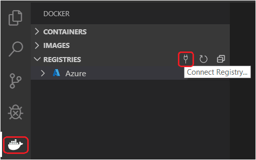
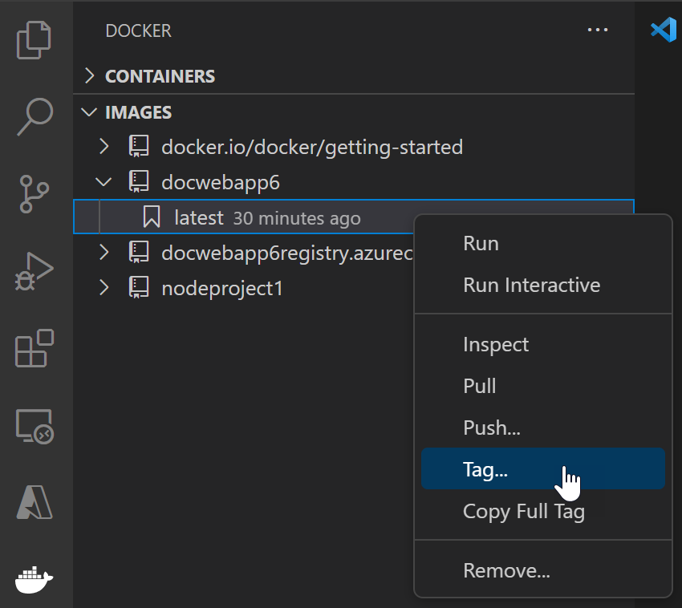
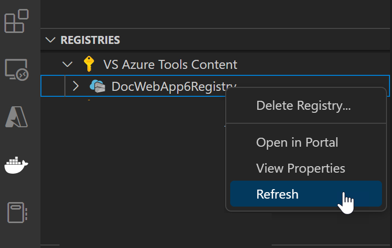
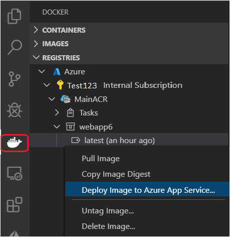

# 将一个容器化的应用程序部署到Azure

In this guide you will learn how to:

- Create a container image for your application.
- Push the image to a container registry.
- Deploy the image to Azure App Service or Azure Container Apps.

## Prerequisites

- An Azure subscription.
- [Docker](https://marketplace.visualstudio.com/items?itemName=ms-azuretools.vscode-docker) and [Azure App Service](https://marketplace.visualstudio.com/items?itemName=ms-azuretools.vscode-azureappservice) extensions must be installed.
- A [**web** application](https://learn.microsoft.com/azure/app-service/tutorial-custom-container) that produces a docker image. You could also follow [Create a sample ASP .NET Core application](/docs/containers/quickstart-aspnet-core.md) to create such application.
- You need a [Docker Hub](https://hub.docker.com/) account or an instance of [Azure Container Registry (ACR)](https://learn.microsoft.com/azure/container-registry/container-registry-get-started-portal).

## Create the application image

If you already have an image, skip this step and proceed to [Push the image to a container registry](#push-the-image-to-a-container-registry) step.

1. Open the application folder in VS Code.

2. Open Command Palette (`kb(workbench.action.showCommands)`) and use **Docker Images: Build Image...** command to build the image.

   

   You can find the image name in the output of the Build Image command, the same can be found in the Images pane of the Docker Explorer.

   

## Push the image to a container registry

Before deploying the image to an App Service or a Container App, the image must be uploaded to a container registry. The image can be uploaded to either [Azure Container Registry (ACR)](https://learn.microsoft.com/azure/container-registry/container-registry-get-started-portal) or [Docker Hub](https://hub.docker.com/).

1. Open the Docker Explorer and select **Connect Registry...** icon under **Registries** group and follow the prompt. Choose the provider (Azure or Docker Hub) and provide the credential to connect to the registry.

   

2. Now the registry will be visible under Registries.

   

3. Optionally, tag the image. In order to upload an image to a registry, the image needs to be tagged with registry name so that the docker push will upload it to the right registry.

   - To create a registry in Azure ACR, open the **Registries** section of the Docker view, sign in to Azure if not already signed in, and then right-click on the subscription you want to use, and choose **Create Registry**.
   - The image built in previous section will appear in the Docker Explorer under Images section. Right-click and choose **Tag...**.

     

   - Specify the new name `<your registry or username>/<image name>:<tag>` and complete the
     tag action. For example, new image name for ACR named WebApp6 would be 'webapp6.azurecr.io/webapp6:latest' and for Docker Hub it would be 'myusername/webapp6:latest'.

4. The image will show up in the Docker Explorer under the registry that the image tag points to. Select this image and choose **Push**. If the image has not yet been tagged, you will be prompted to choose a registry to push to, and the image will be tagged based on the selection.

   

5. Once the push command is completed. Refresh the registry node where the image is pushed to and the uploaded image will show up.

   

## Deploy the image to Azure

In the previous section, the image is pushed to a remote container registry. Now deploy this image to Azure App Service or Azure Container Apps.

1. In Docker Explorer, navigate to your image under Registries, right-click on the tag, and select **Deploy Image To Azure App Service...** or **Deploy Image to Azure Container Apps...**.

   

2. When prompted, provide the values for the App Service or Container App.

   - New web app name: The name must be unique across Azure.
   - Resource group: Select an existing resource group or create a new one.
   - App Service plan: Select an existing App Service Plan or create a new one. (An App Service Plan defines the physical resources that host the website; you can use a basic or free plan tier for this tutorial).

3. When deployment is complete, Visual Studio Code shows a notification with the website URL.

   

4. You can also see the results in the Output panel of Visual Studio Code, in the Docker section.

   

5. To browse the deployed website, you can use `kbstyle(Ctrl+click)` to open the URL in the Output panel. You might need to wait a little while for the app to be live in Azure. The new App Service or Container App also appears in the Azure view in Visual Studio Code, where you can right-click the website and select **Browse Website**.

   

## Next steps

Read on to learn more about

- [Azure Extensions](/docs/azure/extensions.md) - The VS Code Marketplace has hundreds of extensions for Azure and the cloud.
- [Deploying to Azure](/docs/azure/deployment.md) - Learn step-by-step how to deploy your application to Azure.
- [Working with MongoDB](/docs/azure/mongodb.md) - Create, manage, and query MongoDB databases from within VS Code.
