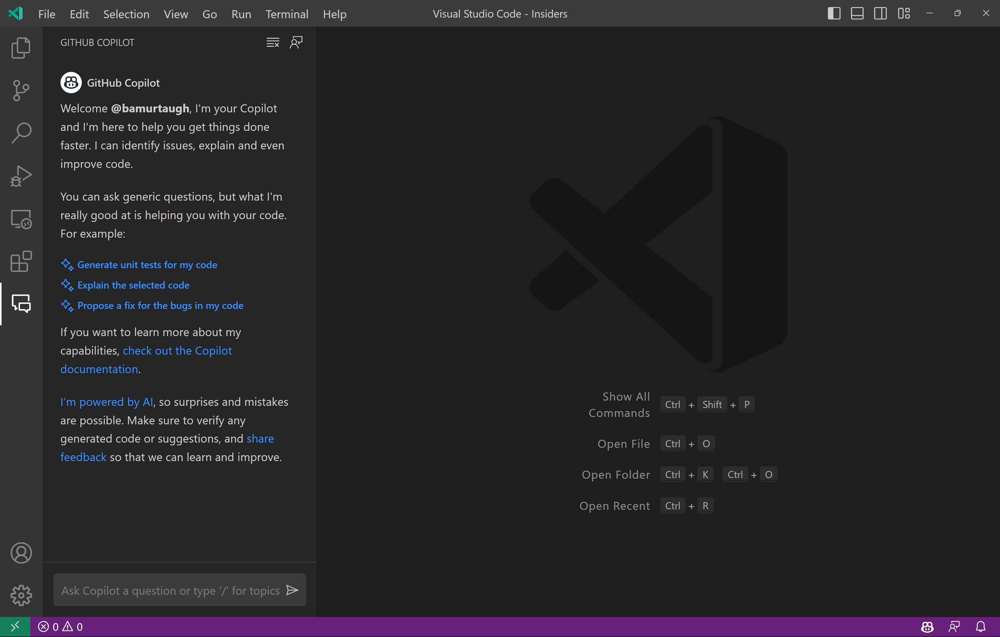
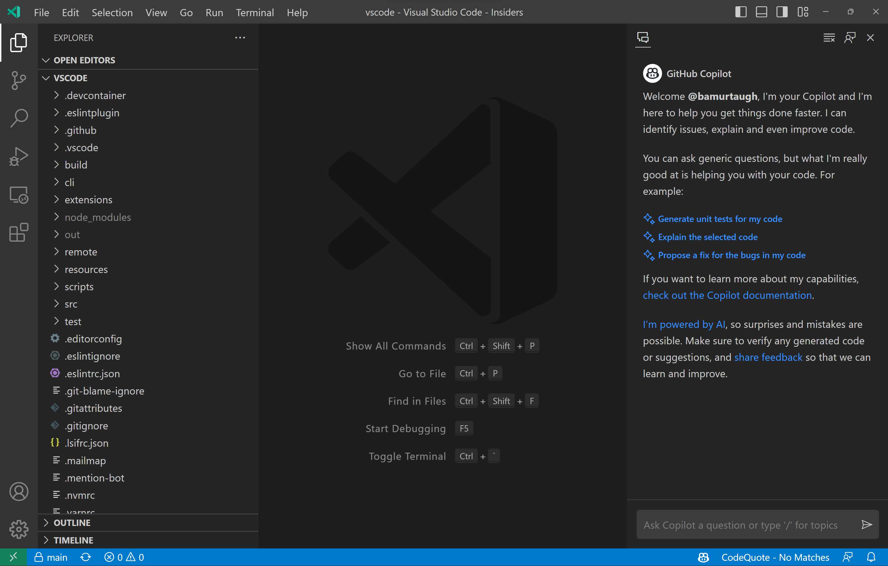
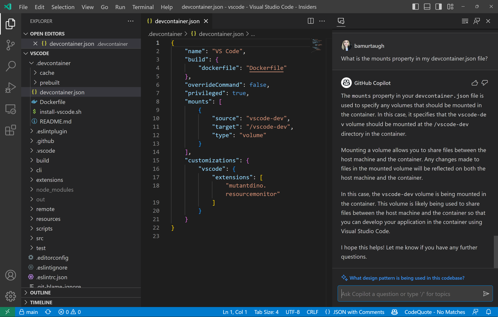
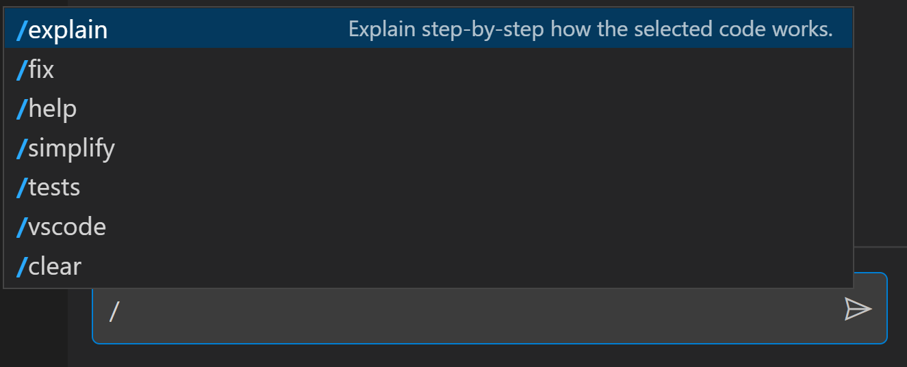
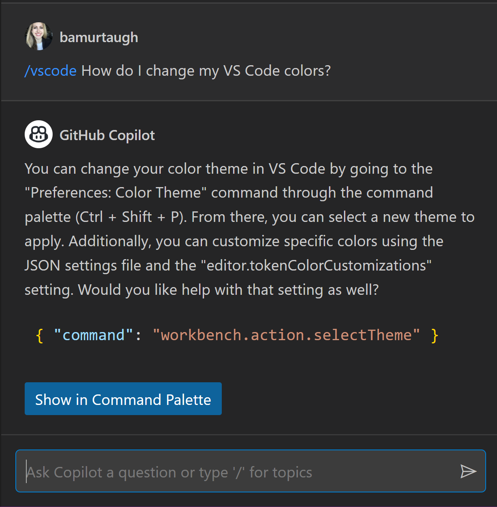
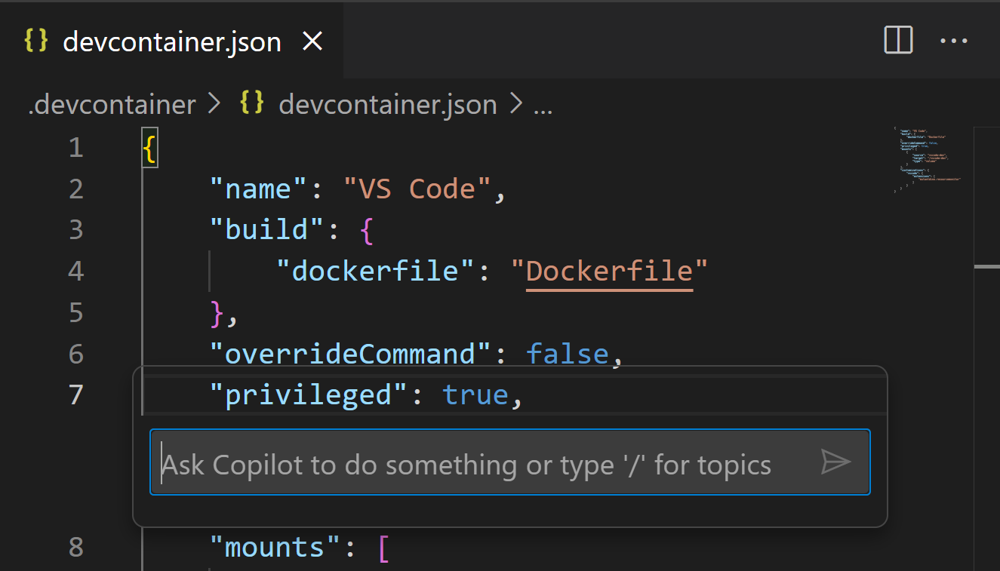

# AI Tools in VS Code

The [GitHub Copilot](https://marketplace.visualstudio.com/items?itemName=GitHub.copilot) extension is an AI pair programmer tool that helps you write code faster and smarter. You can use the Copilot extension in VS Code to generate code, learn from the code it generates, and even configure your editor.

<iframe width="560" height="315" src="https://www.youtube.com/embed/Fi3AJZZregI" title="Get Started with the Future of Coding: GitHub Copilot" frameborder="0" allow="accelerometer; autoplay; clipboard-write; encrypted-media; gyroscope; picture-in-picture" allowfullscreen></iframe>

## Prerequisites

You'll use the [GitHub Copilot](https://marketplace.visualstudio.com/items?itemName=GitHub.copilot) extension to power your AI suggestions in VS Code.

> <a class="install-extension-btn" href="vscode:extension/GitHub.copilot">Install the Copilot extension</a>


To use GitHub Copilot, you need an active GitHub Copilot subscription. In the [content below](#activate-your-free-trial), you'll learn how VS Code will help you activate your free trial directly from VS Code. You can also activate your trial starting from the [GitHub Copilot signup page](https://github.com/github-copilot/signup).

> **Note:** For some of the latest features we'll explore below, you'll need to use the [pre-release version](https://code.visualstudio.com/updates/v1_63#_pre-release-extensions) of the GitHub Copilot extension, which will provide you the latest updates in Copilot.
> 

## Sign in and sign up

If you have not previously authorized VS Code in your GitHub account, you will be prompted to sign in to GitHub in VS Code:


In your browser, GitHub will request the necessary permissions for GitHub Copilot. To approve these permissions, select **Authorize Visual Studio Code**.

### Activate your free trial

If you haven't yet activated your free trial for Copilot, the extension will notify you in VS Code. Select **Signup for GitHub Copilot** to activate your trial.


You can learn more about billing for Copilot in the [GitHub Copilot documentation](https://docs.github.com/billing/managing-billing-for-github-copilot/about-billing-for-github-copilot).

## Using Copilot

Now that you've signed up for Copilot and activated the extension, let's see its assistance in action!

GitHub Copilot provides suggestions for numerous languages and a wide variety of frameworks, and it works especially well for Python, JavaScript, TypeScript, Ruby, Go, C# and C++.

## Inline suggestions

Copilot presents suggestions automatically to help you code more efficiently. There are just 3 steps to harnessing these suggestions:

1. Start writing code (or code-related items, like comments or tests).

Copilot provides suggestions for a variety of languages and frameworks. For any given input, Copilot may offer multiple suggestions. You can select which suggestion to use or reject all suggestions.

2. Receive a Copilot suggestion in gray ghost (faded) text.

Ghost text is placeholder text that will be replaced by input you type or select from Copilot.

As an example, a JavaScript file, you can type the following function header:

```js
function calculateDaysBetweenDates(begin, end) {
```

Copilot will provide a suggestion like the following:


3. Choose to accept Copilot's suggestion.

For any given input, Copilot may offer multiple suggestions. When Copilot offers a suggestion, you can use accept it with the `kbstyle(Tab)` key, or hover over the suggestion to see the inline suggestion toolbar:


In the image above, Copilot presents three suggestions. You can accept the entire suggestion with `kbstyle(Tab)`, or only part of the suggestion with `kbstyle(Ctrl+RightArrow)`. You can switch between suggestions in the suggestion toolbar, or use the keyboard shortcut `kb(editor.action.inlineSuggest.showNext)` instead.

If you don't want to accept any of the suggestions, you can continue typing, and Copilot will continue providing suggestions as you work.

## Getting the most out of Copilot

There are things you can do to help ("prompt") Copilot give you the best possible suggestions. And the good news is that you are probably already doing these right now since they help you and your colleagues understand your code.

Copilot suggestions work best when Copilot has sufficient context to know what you're doing and what you want help with. Just as you would provide a colleague with the context when asking for help with a specific programming task, you can do the same with Copilot.

> **Note**: "Prompt engineering" is a common phrase you'll hear when discussing AI and refers to how and what information is packaged and sent to an AI API endpoint. The Copilot extension does this "prompt engineering" for you but you can help by providing hints to guide the extension.

### Providing context

#### Open files

Copilot looks at the current and open files in your editor to analyze the context and create appropriate suggestions. Having related files open in VS Code while using Copilot helps set this context and lets the Copilot see a bigger picture of your project.

#### Top level comment

Just as you would give a brief, high-level introduction to a coworker, a top level comment in the file you're working in can help Copilot understand the overall context of the pieces you will be creating.

<!-- Example of a good and bad top level comment -->

#### Appropriate includes and references

It's best to manually set the includes or module references you need for your work. Copilot can make suggestions, but you likely know best what dependencies you'll need to include. This can also help let Copilot know what frameworks, libraries, and their versions you'd like it to use when crafting suggestions.

<!-- Example of a Python include TBD -->

#### Meaningful function names

Just as a method called `fetchData()` won't mean much to a coworker (or you after several months), `fetchData()` won't help Copilot either. Using meaningful function names will help Copilot provide a body that does what you want.

<!-- Example of a meaningful function/method name. -->

#### Specific and well-scoped function comments

A function name can only be so descriptive without being overly long so function comments can help fill in details that Copilot might need to know.

<!-- Example of a meaningful function/method comment -->

#### Prime Copilot with sample code

One trick to get Copilot on the right page is to copy and paste sample code that is close to what you are looking for. Providing a small example can help Copilot generate suggestions that match the language and tasks you want to achieve. Once Copilot begins providing you with the code you want and will actually use, you can delete the sample code from the file. This can be especially helpful to jump start Copilot to a newer library version when it defaults to the providing older code suggestions.

### Be consistent and keep the quality bar high

Copilot is going to latch on to your code to generate suggestions that follow the existing pattern so the adage "garbage in, garbage out" applies.

Keeping a high quality bar can take discipline when you're coding fast and loose to get something working and you might want to disable Copilot while in "hacking" mode. You can temporarily deactivate Copilot from the Status bar.


<!-- ### Be specific

break things down into separate specific tasks

Be specific about inputs, outputs, ranges, APIs, frameworks.

### Verify suggestions

Copilot is not a compiler or language service

Tools, which you may already be using, can help.

#### Language Service warnings

#### Linters -->

### More resources

If you'd like to learn more about productively using GitHub Copilot, you can follow up with these videos and blog posts:

- [Effective Prompting for GitHub Copilot](https://www.youtube.com/watch?v=ImWfIDTxn7E)
- [Pragmatic techniques to get the most out of GitHub Copilot](https://www.youtube.com/watch?v=CwAzIpc4AnA)
- [Best practices for prompting GitHub Copilot in VS Code](https://www.linkedin.com/pulse/best-practices-prompting-github-copilot-vs-code-pamela-fox)
- [How to use GitHub Copilot: Prompts, tips, and use cases](https://github.blog/2023-06-20-how-to-write-better-prompts-for-github-copilot/)

## Chat features

In addition to inline suggestions, you can also get assistance from Copilot via a chat interface. This is supported in two ways:

- **Chat view:** Ask Copilot for help with any task or question in the GitHub Copilot Chat view.
- **Inline chat:** Talk with Copilot while writing code, inline in your files.

> **Note:** To get access to the chat view and inline chat, you'll need to sign up for the [GitHub Copilot chat waitlist](https://github.com/github-copilot/chat_waitlist_signup/join). You'll also need to use the **Pre-Release** version of the [GitHub Copilot](https://marketplace.visualstudio.com/items?itemName=GitHub.copilot) extension.

## Chat view

When developing a project or learning something new, it can be a big help to get AI assistance on your questions, big or small. Copilot enables an interactive Chat experience that understands the context of your code, workspace, extensions, settings, and more.

Once you've signed up and been granted access to Copilot chat through the [chat waitlist](https://github.com/github-copilot/chat_waitlist_signup/join), install the [pre-release version](https://code.visualstudio.com/updates/v1_63#_pre-release-extensions) of the GitHub Copilot extension in VS Code. You'll be presented a new GitHub Copilot chat view in the Activity Bar:



Like other views in VS Code, you can move it anywhere. For example, you can move it to the secondary sidebar so that you can use other views like the Explorer at the same time:



Copilot will suggest potential questions to get started. You can select any of these questions or use the chat box to type your own:



As you continue asking questions, Copilot maintains the history of your conversation, and it'll provide related follow-up questions or commands in its response too.

You can help Copilot provide better answers by upvoting or downvoting responses with the thumbs up and down icons in the upper right of its response. This provides Copilot feedback on how much it helped with your scenario so that it can help you even better in the future.

### Slash commands

To further help Copilot give you more relevant answers, you can choose a topic for your questions through "slash commands."

You can prepend your chat inputs with a specific topic name to help Copilot give you a more relevant response. When you start typing `/`, you’ll see the list of possible topics:



- /explain: Explain step-by-step how the selected code works.
- /fix: Propose a fix for the bugs in the selected code.
- /help: Prints general help about GitHub Copilot.
- /tests: Generate unit tests for the selected code.
- /vscode: Questions about VS Code commands and settings.
- /clear: Clear the session.



## Inline chat

An additional key functionality of Copilot is answering questions inline as you're coding. This allows you to harness the power of AI while staying in your existing editor workflow.

In any file, you can press `kb(inlinechat.start)` on your keyboard to bring up Copilot inline chat:



You can ask Copilot questions that emerge as you write and iterate on code, such as "Explain this piece of code" or "How do I add functionality to do X?" Several [slash commands](#slash-commands) also work in inline chat.

## Additional resources

Congratulations, you've now used artificial intelligence to enhance your coding!

You can read more about Copilot and how to use it in VS Code in the [GitHub Copilot documentation](https://docs.github.com/copilot/getting-started-with-github-copilot?tool=vscode).

Or check out the [VS Code Copilot Series](https://www.youtube.com/playlist?list=PLj6YeMhvp2S5_hvBl2SE-7YCHYlLQ0bPt) on Youtube, where you can find more introductory content as well as programming-specific videos for using Copilot with [Python](https://www.youtube.com/watch?v=DSHfHT5qnGc), [C#](https://www.youtube.com/watch?v=VsUQlSyQn1E), [Java](https://www.youtube.com/watch?v=zhCB95cE0HY), [PowerShell](https://www.youtube.com/watch?v=EwtRzAFiXEM), and more.
