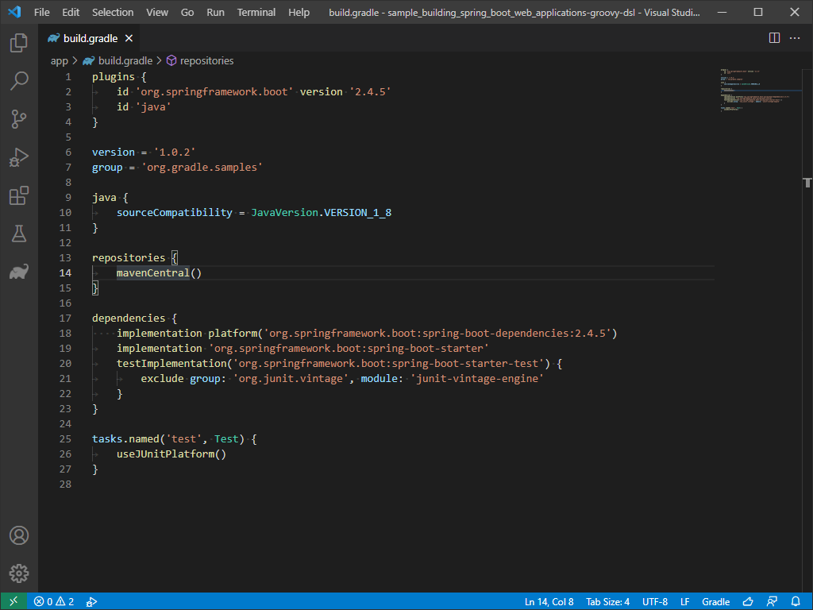
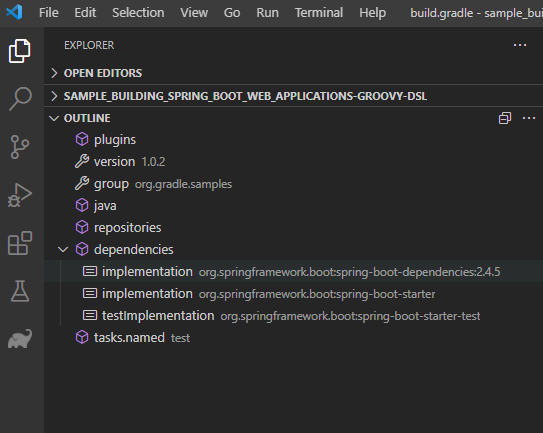
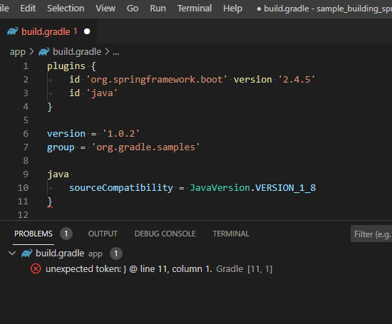

# Java build tools in VS Code

This document is an overview of how to work with your Java build tools in Visual Studio Code. It covers the [Maven for Java](https://marketplace.visualstudio.com/items?itemName=vscjava.vscode-maven) and [Gradle for Java](https://marketplace.visualstudio.com/items?itemName=vscjava.vscode-gradle) extensions as well as other tools.

If you run into any issues when using the features below, you can contact us by entering an [issue](https://github.com/microsoft/vscode-java-pack/issues).

## Maven

[Maven](https://maven.apache.org/) is a software tool that helps you manage Java projects and automate application builds. The [Maven for Java](https://marketplace.visualstudio.com/items?itemName=vscjava.vscode-maven) extension for Visual Studio Code provides fully integrated Maven support, allowing you to explore Maven projects, execute Maven commands, and perform the goals of build lifecycle and plugins. We recommend installing the [Extension Pack for Java](https://marketplace.visualstudio.com/items?itemName=vscjava.vscode-java-pack), which includes Maven support and other important Java development features.

<a class="install-extension-btn" href="vscode:extension/vscjava.vscode-java-pack">Install the Extension Pack for Java</a>

### Exploring Maven project

Once a Maven project is loaded, the extension will be activated and it will automatically scan for `pom.xml` files in your workspace and displays all Maven projects and their modules in the side bar.

### Resolve unknown type

The Maven extension also supports searching Maven Central to resolve unknown types in your source code. You can do this by selecting the **Resolve unknown type** link shown on hover.

<video autoplay loop muted playsinline controls title="Resolve unknown type">
  <source src="/docs/java/java-build/maven-resolve-unknown-type.mp4" type="video/mp4" />
</video>

### Working with POM.xml

The extension provides code snippets and auto completion for adding Maven dependencies based on local Maven repositories. See how easy it is to add a new dependency to your `pom.xml` with those convenient features.

<video autoplay loop muted playsinline controls title="Add a new dependency to POM file">
  <source src="/docs/java/java-build/maven-pom-editing.mp4" type="video/mp4" />
</video>

The extension also enables you to generate effective POM.

<video autoplay loop muted playsinline controls title="Generate effective POM">
  <source src="/docs/java/java-build/maven-effective-pom.mp4" type="video/mp4" />
</video>

You can also use the command **Maven: Add a Dependency** (or `maven.project.addDependency`) to help add a new dependency to `pom.xml`. The process is interactive.

<video autoplay loop muted playsinline controls title="Add a dependency">
  <source src="/docs/java/java-build/maven-add-dependency.mp4" type="video/mp4" />
</video>

You can also add dependencies through the project view, which calls the same Maven command.

<video autoplay loop muted playsinline controls title="Add dependency through project view">
  <source src="/docs/java/java-build/maven-add-dependency-2.mp4" type="video/mp4" />
</video>

Furthermore, VS Code also supports showing dependencies in a tree view, which allows you to inspect all dependencies in your project at a single place and check for potential issues.

<video autoplay loop muted playsinline controls title="Inspect Maven dependency tree">
  <source src="/docs/java/java-build/maven-dependency-tree.mp4" type="video/mp4" />
</video>

### Execute Maven commands and goals

By right-clicking each Maven project in the Explorer, you can conveniently run Maven goals.

<video autoplay loop muted playsinline controls title="Run Maven goals">
  <source src="/docs/java/java-build/maven-run.mp4" type="video/mp4" />
</video>

The extension also preserves the history of goals for each project, so you can quickly rerun the previous command, which is useful when you're running a long custom goal.

There are two ways to rerun a goal:

1. In the Command Palette, run **Maven: History**, then select a project and a command from its history.
2. Right-click a project and select **History**. You can then select a previous command from history.

<video autoplay loop muted playsinline controls title="Run goals from Maven history">
  <source src="/docs/java/java-build/maven-history.mp4" type="video/mp4" />
</video>

You can also specify your favorite commands in settings for future execution.

<video autoplay loop muted playsinline controls title="Specify favorite commands">
  <source src="/docs/java/java-build/maven-favorite-command.mp4" type="video/mp4" />
</video>

For each plug-in you use with your project, the extension also provides you an easy way to access the goals within each plugin.

<video autoplay loop muted playsinline controls title="Easy way to access goals within each plugin">
  <source src="/docs/java/java-build/maven-plugin-goal.mp4" type="video/mp4" />
</video>

To debug Maven goals, right-click on a goal and start debugging. The Maven extension will call the Java debugger with the right parameters. This is a handy, time-saving feature.

<video autoplay loop muted playsinline controls title="Debug Maven goals">
  <source src="/docs/java/java-build/debug-maven-plugin-goals.mp4" type="video/mp4" />
</video>

### Generate project from Maven Archetype

Another handy feature provided by this extension is to generate a Maven project from [Archetype](https://maven.apache.org/guides/introduction/introduction-to-archetypes.html). The extension loads archetypes listed in local/remote catalogs. After selection, the extension sends `mvn archetype:generate -D...` to the terminal.

There are several ways to create a Maven project:

1. From the Maven Explorer, select the **+** **Create Maven Project** button.

   

2. Open the **Command Palette** (`kb(workbench.action.showCommands)`), search for **Create Java Project** command.

   <video autoplay loop muted playsinline controls title="Create Java Project Command">
     <source src="/docs/java/java-build/maven-archetype-command.mp4" type="video/mp4" />
   </video>

3. Right-click on a target folder and select **Create Maven Project**.

   <video autoplay loop muted playsinline controls title="Create Maven Project Command">
     <source src="/docs/java/java-build/maven-archetype-folder.mp4" type="video/mp4" />
   </video>

## Gradle

VS Code supports Gradle Java project (not including Android) via the [Gradle for Java](https://marketplace.visualstudio.com/items?itemName=vscjava.vscode-gradle) extension. The extension provides a visual interface for your Gradle build, you can use this interface to view Gradle Tasks and Project dependencies, or run Gradle Tasks as VS Code Tasks. The extension also offers a better Gradle build file authoring experience including syntax highlighting, error reporting, and auto-completion.

### Working with Gradle tasks

When you open a Gradle project in VSCode, you can find some useful Gradle views by clicking the Gradle Side Bar item. **Gradle Projects** view lists all the Gradle projects found in the workspace. You can view, run, or debug Gradle tasks here.

<video autoplay loop muted playsinline controls title="Gradle tasks view">
  <source src="/docs/java/java-build/gradle-tasks.mp4" type="video/mp4" />
</video>

When there are many Gradle tasks in the workspace, it might be hard to find a specific task. The extension offers a **Pinned Tasks** view to help you pin your favorite tasks so that you can easily find them in a separate view. You can also see recently executed tasks in the **Recent Tasks** view.

<video autoplay loop muted playsinline controls title="Pin a Gradle task">
  <source src="/docs/java/java-build/gradle-pinned-recent-tasks.mp4" type="video/mp4" />
</video>

### Viewing Gradle dependencies

In the **Gradle Projects** view, you can find a **Dependencies** item under each Gradle project item. It includes all the dependencies in your specified configuration, you can easily check the dependency status of your project.

### Managing Gradle Daemons

The **Gradle Daemons** view shows the daemon status of the current workspace. It lists all the running Gradle daemons in the same version as the workspace. You can choose to stop a specific one or all the daemons in this view.

<video autoplay loop muted playsinline controls title="Managing Gradle Daemon">
  <source src="/docs/java/java-build/gradle-daemons.mp4" type="video/mp4" />
</video>

### Authoring build files

The extension provides some useful authoring features on the Gradle build files.

When opening a Groovy Gradle file, the extension will analyze the Gradle file and provide semantic tokens information, providing more precise highlighting results.

In the **Outline** view, the extension provides the document symbols of the opened Gradle file, which can help you to navigate to any part of the file easily.

If there is any syntax error (missing characters, type not found, etc.) in the opened Gradle file, you can find them in the **Problems** view.

The extension supports basic auto completions for a Gradle file, when you're trying to type Gradle closures or properties in a Gradle script, the extension will suggest available closures or properties for you.

<video autoplay loop muted playsinline controls title="Auto completion for Gradle file">
  <source src="/docs/java/java-build/gradle-auto-completion.mp4" type="video/mp4" />
</video>

When you are trying to declare a new dependency, the extension will provide a dependency candidate list for you.

<video autoplay loop muted playsinline controls title="Auto completion for new dependency for Gradle">
  <source src="/docs/java/java-build/gradle-dependency-completion.mp4" type="video/mp4" />
</video>

### Additional resources

Visit the [GitHub Repo](https://github.com/microsoft/vscode-maven) of the Maven extension for additional [configurations](https://github.com/microsoft/vscode-maven/tree/main#additional-configurations) and a [troubleshooting guide](https://github.com/microsoft/vscode-maven/blob/main/Troubleshooting.md).

In addition to Maven, there's also a [Bazel extension](https://marketplace.visualstudio.com/items?itemName=BazelBuild.vscode-bazel) if you use Bazel to build and test your project.

## Next steps

Read on to find out more about:

- [Java editing](/docs/java/java-editing.md) - Explore the editing features for Java in VS Code.
- [Java debugging](/docs/java/java-debugging.md) - Find out how to debug your Java project with VS Code.
- [Java testing](/docs/java/java-testing.md) - Use VS Code for your JUnit and TestNG cases.
- [Java extensions](/docs/java/extensions.md) - Learn about more useful Java extensions for VS Code.
