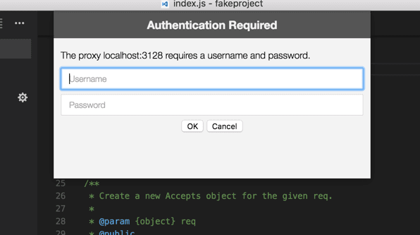

# Visual Studio Code中的网络连接

Visual Studio Code构建在[Electron](https://www.electronjs.org)之上，并受益于[Chromium](https://www.chromium.org/)的所有网络堆栈功能。这也意味着VS Code用户可以在[Google Chrome](https://www.google.com/chrome/index.html)中获得很多网络支持。

## 普通hostnames

VS Code中的一些特性需要网络通信才能工作，比如自动更新机制、查询和安装扩展以及遥测。要使这些特性在代理环境中正常工作，必须正确配置产品。

如果你在防火墙后面，需要允许VS Code使用特定的域，这里是你应该允许通信通过的主机名列表:

- `update.code.visualstudio.com` - Visual Studio Code 下载和更新服务器
- `code.visualstudio.com` - Visual Studio Code 文档
- `go.microsoft.com` - 微软链接转发服务
- `vscode.blob.core.windows.net` - Visual Studio Code blob storage, 用于远程服务器
- `marketplace.visualstudio.com` - Visual Studio 市场
- `*.gallery.vsassets.io` - Visual Studio 市场
- `*.gallerycdn.vsassets.io` - Visual Studio 市场
- `rink.hockeyapp.net` - 事故报告服务
- `bingsettingssearch.trafficmanager.net` - 产品内设置搜索
- `vscode.search.windows.net` - 产品内设置搜索
- `raw.githubusercontent.com` - 访问GitHub存储库原始文件
- `vsmarketplacebadges.dev` - Visual Studio Marketplace徽章服务
- `az764295.vo.msecnd.net` - Visual Studio Code 下载 CDN
- `download.visualstudio.microsoft.com` - Visual Studio 下载服务器，为一些VS Code扩展(c++， c#)提供依赖
- `vscode-sync.trafficmanager.net` - Visual Studio Code 设置同步服务
- `vscode-sync-insiders.trafficmanager.net` - Visual Studio Code 设置同步服务 (内部人士)
- `vscode.dev` - 登录GitHub或微软扩展或设置同步时使用
- `*.vscode-unpkg.net` - 加载web扩展时使用
- `default.exp-tas.com` - Visual Studio Code 实验服务, 用于提供实验性的用户体验

## 代理服务器支持

VS Code具有与Google Chromium完全相同的代理服务器支持。 以下是来自[Chromium的文档](https://www.chromium.org/developers/design-documents/network-settings)的一个片段:

```
"Chromium网络栈使用系统网络设置，因此用户和管理员可以轻松地控制所有应用程序的网络设置。网络设置包括:

 - proxy settings
 - SSL/TLS settings
 - certificate revocation check settings
 - certificate and private key stores"
```

这意味着您的代理设置应该自动拾取。

否则，您可以使用以下命令行参数来控制代理设置:

```bash
# Disable proxy
--no-proxy-server

# Manual proxy address
--proxy-server=<scheme>=<uri>[:<port>][;...] | <uri>[:<port>] | "direct://"

# Manual PAC address
--proxy-pac-url=<pac-file-url>

# Disable proxy per host
--proxy-bypass-list=(<trailing_domain>|<ip-address>)[:<port>][;...]
```

要了解有关这些命令行参数的更多信息，请参阅[Chromium Network Settings](https://www.chromium.org/developers/design-documents/network-settings).

### 认证代理

通过添加[PR #22369](https://github.com/microsoft/vscode/pull/22369)，经过身份验证的代理应该在VS Code中无缝工作。

支持的身份验证方法有:

- Basic
- Digest
- NTLM
- Negotiate

当在经过身份验证的HTTP代理后面使用VS Code时，应该出现以下身份验证弹出框:



Note that SOCKS5 proxy authentication support isn't implemented yet; you can follow the [issue in Chromium's issue tracker](https://bugs.chromium.org/p/chromium/issues/detail?id=256785).

See [Chromium HTTP authentication](https://www.chromium.org/developers/design-documents/http-authentication) to read more about HTTP proxy authentication within VS Code.

### SSL 证书

通常HTTPS代理会重写传入请求的SSL证书。Chromium被设计为拒绝由它不信任的证书签名的响应。如果您遇到任何SSL信任问题，有几个选项可供您选择:

- Since Chromium uses the OS's certificate trust infrastructure, the preferred option is to add your proxy's certificate to your OS's trust chain. See the [Chromium Root Certificate Policy](https://www.chromium.org/Home/chromium-security/root-ca-policy) documentation to learn more.
- If your proxy runs in `localhost`, you can always try the [--allow-insecure-localhost](https://peter.sh/experiments/chromium-command-line-switches/#allow-insecure-localhost) command-line flag.
- If all else fails, you can tell VS Code to ignore all certificate errors using the [--ignore-certificate-errors](https://peter.sh/experiments/chromium-command-line-switches/#ignore-certificate-errors) command-line flag. **Warning:** This is **dangerous** and **not recommended**, since it opens the door to security issues.

## 遗留代理服务器支持

Extensions don't benefit yet from the same proxy support that VS Code supports. You can follow this issue's development in [GitHub](https://github.com/microsoft/vscode/issues/12588).

Similarly to extensions, a few other VS Code features don't yet fully support proxy networking, namely the CLI interface. The CLI interface is what you get when running `code --install-extension vscodevim.vim` from a command prompt or terminal. You can follow this issue's development in [GitHub](https://github.com/microsoft/vscode/issues/29910).

Due to both of these constraints, the `http.proxy`, `http.proxyStrictSSL` and `http.proxyAuthorization` variables are still part of VS Code's settings, yet they are only respected in these two scenarios.

## 故障排除

这里有一些有用的链接，可以帮助你解决VS Code中的网络问题:

- [网络设置](https://www.chromium.org/developers/design-documents/network-settings)
- [调试网络代理的问题](https://www.chromium.org/developers/design-documents/network-stack/debugging-net-proxy)
- [在Chrome浏览器中配置SOCKS代理服务器](https://www.chromium.org/developers/design-documents/network-stack/socks-proxy)
- [代理设置和回退(Windows)](https://www.chromium.org/developers/design-documents/network-stack/proxy-settings-fallback)
