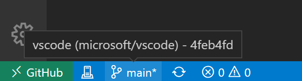
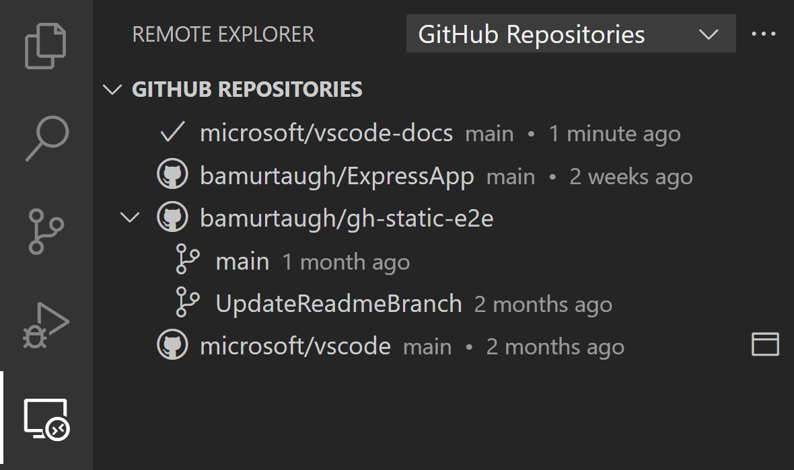

# 在VS Code中使用GitHub

[GitHub](https://github.com)是一个基于云的服务，用于存储和共享源代码。
与Visual Studio Code一起使用GitHub可以让您在编辑器中共享源代码并与其他人协作。
有很多方法可以与GitHub交互，例如，通过他们的网站[https://github.com](https://github.com)或[Git](https://git-scm.com)命令行界面(CLI)，但在VS Code中，丰富的GitHub集成是由[GitHub Pull Requests and Issues](https://marketplace.visualstudio.com/items?itemName=GitHub.vscode-pull-request-github)扩展提供的。

<a class="install-extension-btn" href="vscode:extension/GitHub.vscode-pull-request-github">安装GitHub Pull Requests and Issues扩展</a>

要在VS Code中开始使用GitHub，您需要安装[Git](https://git-scm.com/download)，[创建GitHub帐户](https://docs.github.com/get-started/signing-up-for-github/signing-up-for-a-new-github-account)并安装[GitHub Pull Requests and Issues](https://marketplace.visualstudio.com/items?itemName=GitHub.vscode-pull-request-github)扩展。在这个主题中，我们将演示如何在不离开VS Code的情况下使用GitHub的一些你最喜欢的部分。

如果你是源代码控制的新手，或者想了解更多关于VS Code的基本Git支持，你可以从[源代码控制](/docs/sourcecontrol/overview.md)主题开始。

## 开始与GitHub拉请求和问题

一旦你安装了[GitHub拉请求和问题](https://marketplace.visualstudio.com/items?itemName=GitHub.vscode-pull-request-github)扩展，你需要登录。按照提示在浏览器中使用GitHub进行身份验证，然后返回VS Code。


如果你没有重定向到VS Code，你可以手动添加授权令牌。在浏览器窗口中，您将收到授权令牌。复制令牌，然后切换回VS Code。在状态栏中选择 **Signing in to github.com...** ，粘贴令牌，然后点击 `kbstyle(Enter)`。

## 设置存储库

### 克隆存储库

You can search for and clone a repository from GitHub using the **Git: Clone** command in the Command Palette (`kb(workbench.action.showCommands)`) or by using the **Clone Repository** button in the Source Control view (available when you have no folder open).


From the GitHub repository dropdown you can filter and pick the repository you want to clone locally.


### 使用现有存储库进行身份验证

Enabling authentication through GitHub happens when you run any Git action in VS Code that requires GitHub authentication, such as pushing to a repository that you're a member of or cloning a private repository. You don't need to have any special extensions installed for authentication; it is built into VS Code so that you can efficiently manage your repository.

When you do something that requires GitHub authentication, you'll see a prompt to sign in:


Follow the steps to sign into GitHub and return to VS Code. If authenticating with an existing repository doesn't work automatically, you may need to manually provide a personal access token. See [Personal Access Token authentication](https://github.com/microsoft/vscode-pull-request-github/wiki#personal-access-token-authentication) for more information.

Note that there are several ways to authenticate to GitHub, including using your username and password with two-factor authentication (2FA), a personal access token, or an SSH key. See [About authentication to GitHub](https://docs.github.com/github/authenticating-to-github/about-authentication-to-github) for more information and details about each option.

> **Note**: If you'd like to work on a repository without cloning the contents to your local machine, you can install the [GitHub Repositories](https://marketplace.visualstudio.com/items?itemName=github.remotehub) extension to browse and edit directly on GitHub. You can learn more below in the [GitHub Repositories extension](/docs/sourcecontrol/github.md#github-repositories-extension) section.

## 编辑器集成

### 悬停

当您打开了一个存储库，并且用户是 @-mentioned, 你可以悬停在这个用户名上，看到一个github风格的悬停。


对于 #-mentioned 问题号、完整的GitHub问题url和存储库指定的问题，也有类似的悬停。


### 建议

用户建议由"@"字符触发，问题建议由"#" 字符触发。建议可以在编辑器和 **Source Control** 视图的输入框中找到。


The issues that appear in the suggestion can be configured with the **GitHub Issues: Queries** (`githubIssues.queries`) [setting](/docs/getstarted/settings.md). The queries use the [GitHub search syntax](https://docs.github.com/search-github/getting-started-with-searching-on-github/understanding-the-search-syntax).

You can also configure which files show these suggestions using the settings **GitHub Issues: Ignore Completion Trigger** (`githubIssues.ignoreCompletionTrigger`) and **GitHub Issues: Ignore User Completion Trigger** (`githubIssues.ignoreUserCompletionTrigger`). These settings take an array of [language identifiers](/docs/languages/identifiers.md) to specify the file types.

```jsonc
// Languages that the '#' character should not be used to trigger issue completion suggestions.
"githubIssues.ignoreCompletionTrigger": [
  "python"
]
```

## 拉请求

从 **Pull Requests** 视图中，您可以查看、管理和创建Pull request。


The queries used to display pull requests can be configured with the **GitHub Pull Requests: Queries** (`githubPullRequests.queries`) setting and use the [GitHub search syntax](https://docs.github.com/search-github/getting-started-with-searching-on-github/understanding-the-search-syntax).

```json
"githubPullRequests.queries": [
    {
        "label": "Assigned To Me",
        "query": "is:open assignee:${user}"
    },
```

### 创建拉取请求

Once you have committed changes to your fork or branch, you can use the **GitHub Pull Requests: Create Pull Request** command or the **Create Pull Request** button in the **Pull Requests** view to create a pull request.


A new **Create Pull Request** view will be displayed where you can select the repository and branch you'd like your pull request to target as well as fill in details such as the title, description, and whether it is a draft PR. If your repository has a pull request template, this will automatically be used for the description.


Once you select **Create**, if you have not already pushed your branch to a GitHub remote, the extension will ask if you'd like to publish the branch and provides a dropdown to select the specific remote.

The **Create Pull Request** view now enters **Review Mode**, where you can review the details of the PR, add comments, reviewers, and labels, and merge the PR once it's ready.

After the PR is merged, you'll have the option to delete both the remote and local branch.

### 回顾

拉请求可以从 **拉请求** 视图中查看。您可以分配审稿人和标签，添加评论，批准，关闭和合并所有来自拉取请求 **描述**。


From the **Description** page, you can also easily checkout the pull request locally using the **Checkout** button. This will switch VS Code to open the fork and branch of the pull request (visible in the Status bar) in **Review Mode** and add a new **Changes in Pull Request** view from which you can view diffs of the current changes as well as all commits and the changes within these commits. Files that have been commented on are decorated with a diamond icon. To view the file on disk, you can use the **Open File** inline action.


The diff editors from this view use the local file, so file navigation, IntelliSense, and editing work as normal. You can add comments within the editor on these diffs. Both adding single comments and creating a whole review is supported.

When you are done reviewing the pull request changes you can merge the PR or select **Exit Review Mode** to go back to the previous branch you were working on.

## 问题

### 创建问题

Issues can be created from the **+** button in the **Issues** view and by using the **GitHub Issues: Create Issue from Selection** and **GitHub Issues: Create Issue from Clipboard** commands. They can also be created using a Code Action for "TODO" comments. When creating issues, you can take the default description or select the **Edit Description** pencil icon in the upper right to bring up an editor for the issue body.


You can configure the trigger for the Code Action using the **GitHub Issues: Create Issue Triggers** (`githubIssues.createIssueTriggers`) setting.

The default issue triggers are:

```json
"githubIssues.createIssueTriggers": [
  "TODO",
  "todo",
  "BUG",
  "FIXME",
  "ISSUE",
  "HACK"
]
```

### 解决问题

From the **Issues** view, you can see your issues and work on them.


By default, when you start working on an issue (**Start Working on Issue** context menu item), a branch will be created for you, as shown in the Status bar in the image below.


The Status bar also shows the active issue and if you select that item, a list of issue actions are available such as opening the issue on the GitHub website or creating a pull request.


You can configure the name of the branch using the **GitHub Issues: Issue Branch Title** (`githubIssues.issueBranchTitle`) setting. If your workflow doesn't involve creating a branch, or if you want to be prompted to enter a branch name every time, you can skip that step by turning off the **GitHub Issues: Use Branch For Issues** (`githubIssues.useBranchForIssues`) setting.

Once you are done working on the issue and want to commit a change, the commit message input box in the **Source Control** view will be populated with a message, which can be configured with **GitHub Issues: Working Issue Format SCM** (`githubIssues.workingIssueFormatScm`).

## GitHub仓库扩展

The [GitHub Repositories](https://marketplace.visualstudio.com/items?itemName=github.remotehub) extension lets you quickly browse, search, edit, and commit to any remote GitHub repository directly from within Visual Studio Code, without needing to clone the repository locally. This can be fast and convenient for many scenarios, where you just need to review source code or make a small change to a file or asset.


### 打开存储库

Once you have installed the GitHub Repositories extension, you can open a repository with the **GitHub Repositories: Open Repository...** command from the Command Palette (`kb(workbench.action.showCommands)`) or by clicking the Remote indicator in the lower left of the Status bar.


When you run the **Open Repository** command, you then choose whether to open a repository from GitHub, open a Pull Request from GitHub, or reopen a repository that you had previously connected to.

If you haven't logged into GitHub from VS Code before, you'll be prompted to authenticate with your GitHub account.


You can provide the repository URL directly or search GitHub for the repository you want by typing in the text box.

Once you have selected a repository or Pull Request, the VS Code window will reload and you will see the repository contents in the File Explorer. You can then open files (with full syntax highlighting and bracket matching), make edits, and commit changes, just like you would working on a local clone of a repository.

One difference from working with a local repository is that when you commit a change with the GitHub Repository extension, the changes are pushed directly to the remote repository, similar to if you were working in the GitHub web interface.

Another feature of the GitHub Repositories extension is that every time you open a repository or branch, you get the up-to-date sources available from GitHub. You don't need to remember to pull to refresh as you would with a local repository.

The GitHub Repositories extension supports viewing and even committing LFS-tracked files without needing to install [Git LFS](https://git-lfs.github.com) (Large File System) locally. Add the file types you want tracked with LFS to a [`.gitattributes` file](https://git-lfs.com), then commit your changes directly to GitHub using the Source Control view.

### 切换分支

You can easily switch between branches by clicking on the branch indicator in the Status bar. One great feature of the GitHub Repositories extension is that you can switch branches without needing to stash uncommitted changes. The extension remembers your changes and reapplies them when you switch branches.



### 远程浏览器

You can quickly reopen remote repositories with the Remote Explorer available on the Activity bar. This view shows you the previously opened repositories and branches.



### 创建拉取请求

If your workflow uses Pull Requests, rather than direct commits to a repository, you can create a new PR from the Source Control view. You'll be prompted to provide a title and create a new branch.


Once you have created a Pull Request, you can use the [GitHub Pull Request and Issues](https://marketplace.visualstudio.com/items?itemName=GitHub.vscode-pull-request-github) extension to review, edit, and merge your PR as described [earlier](/docs/sourcecontrol/github.md#pull-requests) in this topic.

### 虚拟文件系统

Without a repository's files on your local machine, the GitHub Repositories extension creates a virtual file system in memory so you can view file contents and make edits. Using a virtual file system means that some operations and extensions which assume local files are not enabled or have limited functionality. Features such as tasks, debugging, and integrated terminals are not enabled and you can learn about the level of support for the virtual file system via the **features are not available** link in the Remote indicator hover.


Extension authors can learn more about running in a virtual file system and workspace in the [Virtual Workspaces extension author's guide](https://github.com/microsoft/vscode/wiki/Virtual-Workspaces).

### 继续努力...

Sometimes you'll want to switch to working on a repository in a development environment with support for a local file system and full language and development tooling. The GitHub Repositories extension makes it easy for you to:

- Create a GitHub codespace (if you have the [GitHub Codespaces extension](https://marketplace.visualstudio.com/items?itemName=GitHub.codespaces)).
- Clone the repository locally.
- Clone the repository into a Docker container (if you have [Docker](https://docker.com/) and the Microsoft [Docker extension](https://marketplace.visualstudio.com/items?itemName=ms-azuretools.vscode-docker) installed).

To switch development environments, use the **Continue Working On...** command, available from the Command Palette (`kb(workbench.action.showCommands)`) or by clicking on the Remote indicator in the Status bar.


If you are using the [browser-based editor](/docs/remote/codespaces.md#browserbased-editor), the **"Continue Working On..."** command has the options to open the repository locally or within a cloud-hosted environment in [GitHub Codespaces](https://github.com/features/codespaces).


The first time that you use **Continue Working On** with uncommitted changes, you will have the option to bring your edits to your selected development environment using **Cloud Changes**, which uses a VS Code service to store your pending changes.

These changes are deleted from our service once they are applied to your target development environment. If you choose to continue without your uncommitted changes, you can always change this preference later by configuring the setting `"workbench.cloudChanges.continueOn": "prompt"`.

## GitHub Copilot

在VS Code中，您可以使用人工智能(AI)来增强编码，例如对代码行或整个函数的建议，快速文档创建，以及帮助创建代码相关的工件(如测试)。

[GitHub Copilot](https://copilot.github.com/)是一个基于人工智能的代码完成工具，可以帮助您更快，更智能地编写代码。你可以在VS Code中使用[GitHub Copilot扩展](https://marketplace.visualstudio.com/items?itemName=GitHub.copilot)来生成代码，或者从它生成的代码中学习。


你可以在[Copilot文档](/docs/editor/artificial-intelligence.md)中了解更多关于如何开始使用Copilot的信息。
